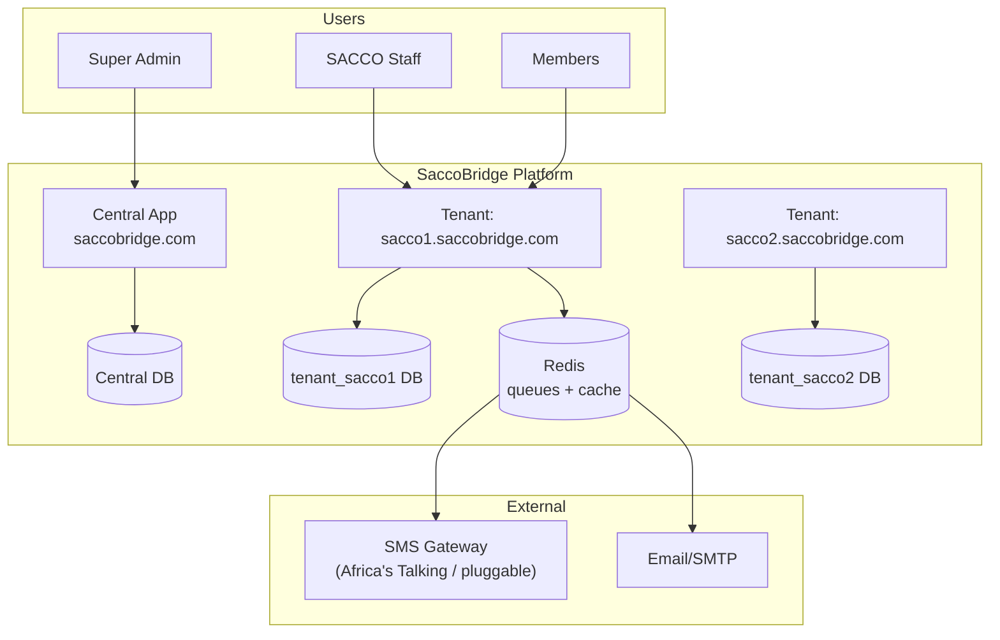
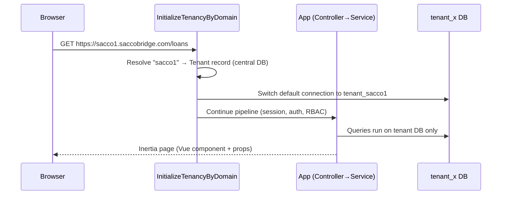
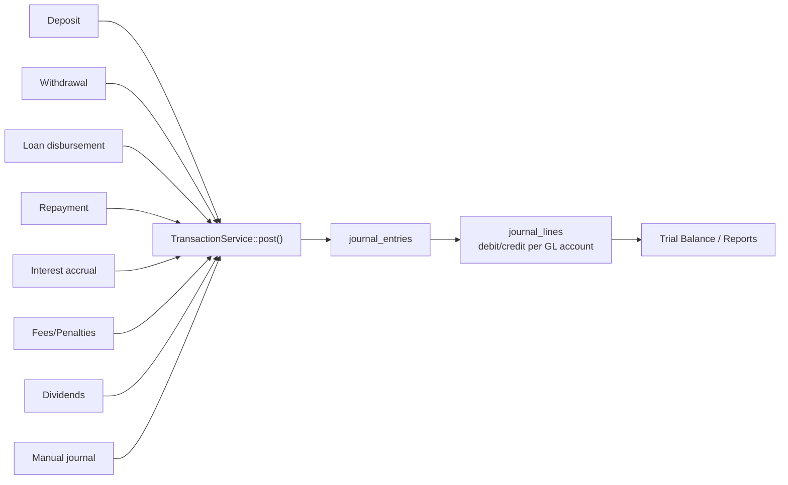
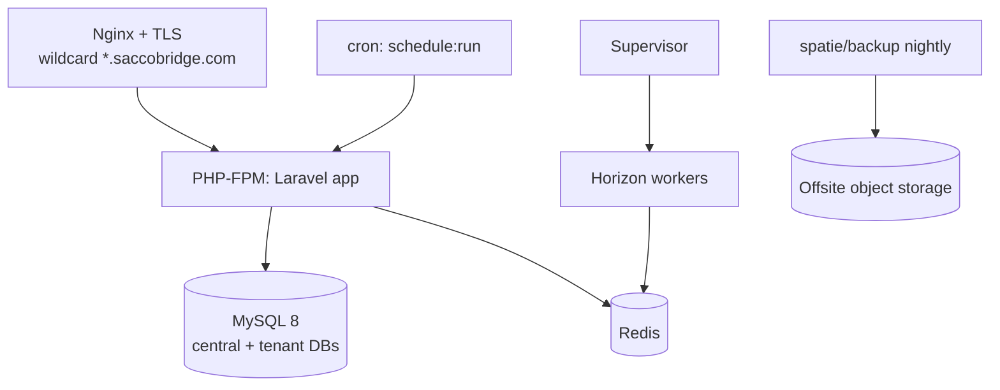

# SaccoBridge — System Architecture Document

**Version:** 1.0 | **Date:** 2026-07-13 | **Status:** Approved

---

## 1. Architectural Style

**Modular layered monolith** with server-driven SPA (Laravel + Inertia.js + Vue 3), **database-per-tenant** multi-tenancy, and a framework-agnostic **service layer** holding all financial logic.

Why a monolith with Inertia (not a decoupled API + SPA):
- No duplicate validation, no CORS, no token plumbing — session auth via Laravel.
- Core logic in service classes means a future mobile app reuses the exact services through `routes/api.php` (Sanctum tokens) without touching ledger code.

## 2. System Context



## 3. Layers

| Layer | Contents | Rules |
|-------|----------|-------|
| Presentation | Inertia pages (Vue 3 SFCs), shared layouts, form components | No business logic |
| HTTP | Controllers, Form Requests, Middleware, Inertia responses | Thin; delegates to services |
| **Service** | `TransactionService`, `LoanService`, `SavingsService`, `ShareService`, `MemberService`, `ReportService`, `SmsManager` | All business/financial logic; framework-agnostic; DB transactions |
| Domain/Data | Eloquent models, enums, policies | Relations, scopes, casts |
| Infrastructure | Tenancy bootstrap, queues (Horizon), storage, SMS drivers, backup | |

### 3.1 Service layer contract
- Every financial operation goes through a service method that runs inside `DB::transaction()`.
- Every money-moving service method calls `TransactionService::post()` which writes a **balanced journal entry** (throws if Σdebits ≠ Σcredits).
- Services never read the HTTP request; they take typed DTOs/arrays — reusable from web controllers, API controllers, jobs, and seeders.

## 4. Multi-Tenancy (stancl/tenancy v3)

### 4.1 Model
- **Central DB**: `tenants`, `domains`, plans/subscriptions, super admins.
- **Tenant DB** (`tenant_{id}`): everything else — users, members, savings, loans, GL, audit.
- Tenant identified by **subdomain**; tenancy bootstrappers switch the default DB connection, cache prefix, filesystem root, and queue payloads per tenant.

### 4.2 Request lifecycle



### 4.3 Tenant provisioning
Creating a tenant (Super Admin action) triggers: create DB → run tenant migrations → seed CoA, roles/permissions, default settings → create SACCO Admin user → (optional) run demo seeder.

### 4.4 Isolation guarantees
- Separate database per tenant — no `tenant_id` filtering to forget.
- Tenant-scoped filesystem disk (`storage/tenant{id}/...`) for KYC documents.
- Queued jobs serialize tenant context; workers re-initialize tenancy before execution.
- Cache keys prefixed per tenant.

## 5. Double-Entry Accounting Engine



- `journal_entries` are **immutable**; corrections are posted as reversal entries.
- Each entry stores a polymorphic `source` (loan, savings transaction, …) for drill-down.
- Postings blocked into closed financial periods.

## 6. Asynchronous Processing
- **Redis + Laravel Horizon** for queues: SMS/email, interest accrual runs, penalty runs, report generation, backups.
- Scheduled jobs (`schedule`): daily interest accrual, daily arrears/penalty & classification run, dormancy checks, daily tenant backups, loan due reminders.

## 7. Notifications
- `SmsManager` (Laravel Manager pattern) with drivers: `africastalking` (default), `log` (dev), future `yo`, `infobip`. Selected via `SMS_DRIVER` env per deployment; per-tenant credentials in tenant settings.
- Laravel Notifications with custom `sms` channel + `mail` channel; all queued.

## 8. Security Architecture (summary)
Session auth (staff/members on tenant), Sanctum tokens (future mobile API), TOTP 2FA for staff, `spatie/laravel-permission` RBAC, `spatie/laravel-activitylog` audit, HTTPS-only, rate limiting, CSP headers. Full detail: [05-security-policy.md](05-security-policy.md).

## 9. Deployment Topology (production)



- Single VPS to start (Ubuntu 22.04, Nginx, PHP 8.3-FPM, MySQL 8, Redis, Supervisor).
- Scale path: move MySQL to managed DB → add app servers behind LB → distribute tenant DBs across DB servers (tenancy supports per-tenant DB hosts).

## 10. Directory Structure (key)

```
app/
  Enums/                    # LoanStatus, MemberStatus, EntryType, ...
  Models/                   # Central: Tenant, Domain | Tenant: Member, Loan, ...
  Services/
    Accounting/TransactionService.php
    Loans/LoanService.php  Loans/AmortizationCalculator.php
    Savings/SavingsService.php
    Shares/ShareService.php
    Members/MemberService.php
    Reports/ReportService.php
    Sms/SmsManager.php  Sms/Drivers/{AfricasTalkingDriver,LogDriver}.php
  Http/Controllers/{Central,Tenant}/...
  Jobs/  Notifications/  Policies/
database/
  migrations/               # central migrations
  migrations/tenant/        # tenant migrations
  seeders/                  # CoA, roles, DemoSaccoSeeder
resources/js/
  Pages/{Auth,Dashboard,Members,Savings,Shares,Loans,Accounting,Reports,Admin}/
  Layouts/  Components/
routes/
  web.php                   # central routes
  tenant.php                # tenant routes (subdomain)
  api.php                   # future mobile API
docs/                       # this document set
```

## 11. Key Decisions Log
| Decision | Choice | Rationale |
|----------|--------|-----------|
| Tenancy | DB-per-tenant (stancl/tenancy) | Strongest isolation for financial data; per-tenant backup/restore |
| Frontend | Inertia + Vue 3 | SPA UX, zero API boilerplate, solo-dev velocity |
| Money | DECIMAL(20,2) / rates DECIMAL(9,6) | Exact arithmetic in SQL; UGX has no subunits in practice |
| Ledger | Immutable double-entry via one service | Auditability; UMRA reports derive from GL |
| SMS | Manager-pattern drivers | Aggregator outage risk; hot-swap via .env |
| Queue | Redis + Horizon | Reliable async SMS/reports/accruals with visibility |
