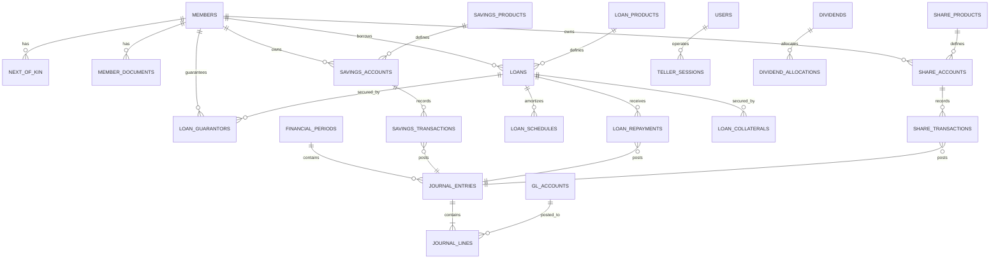

# SaccoBridge — Database Design Document

**Version:** 1.0 | **Date:** 2026-07-13 | **Status:** Approved

Conventions: MySQL 8, InnoDB, `utf8mb4`. Money = `DECIMAL(20,2)`, rates = `DECIMAL(9,6)`. All tables have `id` (BIGINT UNSIGNED PK), `created_at`, `updated_at` unless noted. Soft deletes only where stated (never on financial records — corrections by reversal).

---

## 1. Central Database (landlord)

### tenants
| Column | Type | Notes |
|--------|------|-------|
| id | CHAR(36) / string | tenant key (used in DB name `tenant_{id}`) |
| name | VARCHAR(150) | SACCO legal name |
| umra_license_no | VARCHAR(50) NULL | |
| plan_id | FK → plans NULL | |
| status | ENUM(active, suspended, provisioning) | |
| data | JSON | stancl/tenancy custom columns |

### domains
`id, domain (UNIQUE), tenant_id FK → tenants` — subdomain records (`sacco1.saccobridge.com`).

### plans
`id, name, price DECIMAL(20,2), billing_cycle ENUM(monthly, annual), limits JSON (max_members, sms_credits), is_active BOOL`.

### subscriptions
`id, tenant_id FK, plan_id FK, starts_at, ends_at, status ENUM(active, past_due, cancelled)`.

### users (central)
Platform super admins only: `id, name, email UNIQUE, password, two_factor_secret NULL, ...`.

---

## 2. Tenant Database (one per SACCO)

### 2.1 Identity & Access

**users** (staff + member portal logins)
`id, name, email UNIQUE NULL, phone UNIQUE NULL, password, member_id FK NULL (set for member logins), two_factor_secret NULL, two_factor_confirmed_at NULL, is_active BOOL, last_login_at`.

**roles / permissions / model_has_roles / model_has_permissions / role_has_permissions** — `spatie/laravel-permission` standard tables. Seeded roles: `sacco-admin, manager, loan-officer, teller, accountant, auditor, member`.

**activity_log** — `spatie/laravel-activitylog` standard table (subject, causer, event, properties JSON old/new, ip in properties). Append-only.

**settings**
`id, key VARCHAR(100) UNIQUE, value JSON` — branding, financial year start, approval thresholds, numbering formats, SMS credentials.

### 2.2 Members & KYC

**members**
| Column | Type | Notes |
|--------|------|-------|
| member_no | VARCHAR(20) UNIQUE | auto-generated, e.g. SB-00001 |
| type | ENUM(individual, group, institution) | |
| first_name, last_name | VARCHAR(100) | group/institution use `name` in first_name |
| nin | VARCHAR(20) UNIQUE NULL | National ID |
| date_of_birth | DATE NULL | |
| gender | ENUM(male, female, other) NULL | |
| phone | VARCHAR(20) | indexed |
| email | VARCHAR(150) NULL | |
| district, subcounty, village | VARCHAR(100) NULL | |
| occupation | VARCHAR(100) NULL | |
| photo_path, signature_path | VARCHAR(255) NULL | tenant disk |
| status | ENUM(pending, active, dormant, exited) | indexed |
| approved_by | FK → users NULL | maker-checker |
| approved_at, joined_at, exited_at | TIMESTAMP/DATE NULL | |

**next_of_kin** — `id, member_id FK, name, relationship, phone, nin NULL, address NULL`.

**member_documents** — `id, member_id FK, type ENUM(national_id, proof_of_address, photo, signature, other), path, original_name, uploaded_by FK → users`.

### 2.3 Chart of Accounts & Ledger

**gl_accounts**
| Column | Type | Notes |
|--------|------|-------|
| code | VARCHAR(10) UNIQUE | e.g. 1100 |
| name | VARCHAR(150) | |
| type | ENUM(asset, liability, equity, income, expense) | |
| parent_id | FK → gl_accounts NULL | hierarchy |
| is_system | BOOL | system accounts undeletable |
| is_active | BOOL | |

**financial_periods** — `id, name (e.g. 2026-07), starts_on DATE, ends_on DATE, status ENUM(open, closed), closed_by FK NULL, closed_at NULL`. UNIQUE(starts_on).

**journal_entries**
| Column | Type | Notes |
|--------|------|-------|
| reference | VARCHAR(30) UNIQUE | JE-000001 |
| entry_date | DATE | indexed |
| financial_period_id | FK | |
| description | VARCHAR(255) | |
| source_type, source_id | polymorphic NULL | drill-down to origin |
| status | ENUM(posted, reversed) | |
| reversal_of_id | FK → journal_entries NULL | |
| posted_by | FK → users | |

**journal_lines**
`id, journal_entry_id FK, gl_account_id FK, debit DECIMAL(20,2) DEFAULT 0, credit DECIMAL(20,2) DEFAULT 0, memo NULL`.
CHECK: `(debit = 0) <> (credit = 0)` (exactly one side non-zero). App-level invariant: per entry Σdebit = Σcredit. Index (gl_account_id, journal_entry_id).

### 2.4 Savings

**savings_products**
`id, name, code UNIQUE, interest_rate DECIMAL(9,6), interest_basis ENUM(daily_balance, monthly_min_balance), interest_posting ENUM(monthly, quarterly, annually), min_opening_deposit DECIMAL(20,2), min_balance DECIMAL(20,2), withdrawal_fee DECIMAL(20,2), max_withdrawals_per_month INT NULL, gl_liability_account_id FK, gl_interest_expense_account_id FK, is_active BOOL`.

**savings_accounts**
`id, account_no VARCHAR(20) UNIQUE, member_id FK, savings_product_id FK, balance DECIMAL(20,2) DEFAULT 0, blocked_amount DECIMAL(20,2) DEFAULT 0 (loan pledges), status ENUM(active, dormant, closed), opened_at, closed_at NULL`. Index (member_id).

**savings_transactions**
| Column | Type | Notes |
|--------|------|-------|
| reference | VARCHAR(30) UNIQUE | receipt no |
| savings_account_id | FK | indexed |
| type | ENUM(deposit, withdrawal, transfer_in, transfer_out, interest, fee, dividend_credit, loan_disbursement, loan_repayment_debit) | |
| amount | DECIMAL(20,2) | positive |
| balance_after | DECIMAL(20,2) | running balance snapshot |
| journal_entry_id | FK | GL link |
| teller_session_id | FK NULL | |
| performed_by | FK → users | |
| approved_by | FK → users NULL | large withdrawals |
| value_date | DATE | |

**teller_sessions**
`id, user_id FK (teller), opening_float DECIMAL(20,2), closing_declared DECIMAL(20,2) NULL, closing_system DECIMAL(20,2) NULL, variance DECIMAL(20,2) NULL, status ENUM(open, closed, reconciled), opened_by FK, closed_at NULL`.

**vault_movements**
`id, direction ENUM(vault_to_teller, teller_to_vault, bank_to_vault, vault_to_bank), amount DECIMAL(20,2), teller_session_id FK NULL, journal_entry_id FK, performed_by FK, approved_by FK NULL`.

### 2.5 Shares & Dividends

**share_products** — `id, name, nominal_value DECIMAL(20,2), min_shares INT, max_shares INT NULL, gl_equity_account_id FK, is_active BOOL`.

**share_accounts** — `id, member_id FK, share_product_id FK, shares_count BIGINT DEFAULT 0, UNIQUE(member_id, share_product_id)`.

**share_transactions**
`id, reference UNIQUE, share_account_id FK, type ENUM(purchase, transfer_in, transfer_out, redemption), shares INT, amount DECIMAL(20,2), journal_entry_id FK, performed_by FK, approved_by FK NULL`.

**dividends** — `id, financial_year VARCHAR(9), share_product_id FK, rate DECIMAL(9,6) NULL, total_amount DECIMAL(20,2), status ENUM(declared, approved, distributed), declared_by FK, approved_by FK NULL, distributed_at NULL, journal_entry_id FK NULL`.

**dividend_allocations** — `id, dividend_id FK, member_id FK, shares_held BIGINT, amount DECIMAL(20,2), paid_to ENUM(savings, cash), savings_transaction_id FK NULL`.

### 2.6 Loans

**loan_products**
| Column | Type |
|--------|------|
| name, code UNIQUE | |
| interest_rate DECIMAL(9,6) (per annum) | |
| interest_method ENUM(flat, reducing_balance) | |
| min_amount, max_amount DECIMAL(20,2) | |
| min_term_months, max_term_months INT | |
| grace_period_days INT DEFAULT 0 | |
| application_fee, processing_fee_flat DECIMAL(20,2); processing_fee_rate DECIMAL(9,6) | |
| penalty_rate DECIMAL(9,6) (per month on overdue) | |
| required_guarantors INT DEFAULT 0 | |
| savings_multiple DECIMAL(9,2) NULL (loan ≤ n× savings) | |
| gl_portfolio_account_id, gl_interest_income_account_id, gl_fee_income_account_id, gl_penalty_income_account_id, gl_provision_expense_account_id, gl_provision_reserve_account_id FK | |
| is_active BOOL | |

**loans**
| Column | Type | Notes |
|--------|------|-------|
| loan_no | VARCHAR(20) UNIQUE | LN-00001 |
| member_id FK, loan_product_id FK, loan_officer_id FK → users | | |
| applied_amount, approved_amount, disbursed_amount | DECIMAL(20,2) | |
| term_months INT, interest_rate DECIMAL(9,6), interest_method | copied from product at approval | |
| purpose VARCHAR(255) | | |
| status | ENUM(draft, submitted, under_review, approved, rejected, disbursed, active, restructured, closed, written_off) | indexed |
| classification | ENUM(performing, watch, substandard, doubtful, loss) DEFAULT performing | indexed |
| days_in_arrears INT DEFAULT 0, arrears_amount DECIMAL(20,2) DEFAULT 0 | updated by daily job | |
| provision_amount DECIMAL(20,2) DEFAULT 0 | | |
| principal_outstanding, interest_outstanding DECIMAL(20,2) | | |
| applied_at, approved_at, disbursed_at, closed_at, written_off_at | NULL | |
| approved_by, rejected_by FK NULL; rejection_reason NULL | maker-checker | |
| disbursement_method ENUM(savings, cash); disbursement_savings_account_id FK NULL | | |
| restructured_from_id FK → loans NULL | | |

**loan_schedules**
`id, loan_id FK, installment_no INT, due_date DATE, principal_due, interest_due, fee_due, penalty_due DECIMAL(20,2), principal_paid, interest_paid, fee_paid, penalty_paid DECIMAL(20,2) DEFAULT 0, status ENUM(pending, partial, paid, overdue), paid_at NULL`. UNIQUE(loan_id, installment_no); index (due_date, status).

**loan_repayments**
`id, reference UNIQUE, loan_id FK, amount DECIMAL(20,2), principal_portion, interest_portion, fee_portion, penalty_portion DECIMAL(20,2), method ENUM(cash, savings), savings_transaction_id FK NULL, journal_entry_id FK, teller_session_id FK NULL, performed_by FK, value_date DATE`.

**loan_guarantors**
`id, loan_id FK, member_id FK (guarantor), guarantee_type ENUM(savings, shares), amount DECIMAL(20,2), status ENUM(pending, accepted, released), UNIQUE(loan_id, member_id)`.

**loan_collaterals**
`id, loan_id FK, description VARCHAR(255), estimated_value DECIMAL(20,2), document_path NULL, status ENUM(held, released)`.

**loan_charges** — `id, loan_id FK, type ENUM(application_fee, processing_fee, penalty, other), amount DECIMAL(20,2), journal_entry_id FK NULL, charged_at`.

### 2.7 Notifications

**notification_logs**
`id, channel ENUM(sms, email), recipient VARCHAR(150), member_id FK NULL, template VARCHAR(50), body TEXT, driver VARCHAR(30), status ENUM(queued, sent, failed), provider_ref NULL, error NULL, sent_at NULL`.

---

## 3. ERD (core relationships)

## 4. Integrity Rules
1. **Double-entry invariant**: per journal entry, Σ(debit) = Σ(credit) — enforced in `TransactionService` inside a DB transaction; verified by tests.
2. **Immutability**: no UPDATE/DELETE on `journal_entries`/`journal_lines` after posting; corrections via reversal entries.
3. **Balance snapshots**: `savings_transactions.balance_after` written under row lock (`SELECT ... FOR UPDATE` on the account).
4. **Closed periods**: trigger-free app guard — posting into a closed `financial_period` rejected.
5. **No soft deletes on financial tables**; members/products deactivate rather than delete.
6. **Numbering**: sequential per tenant via `settings` counters inside transactions (gap-free receipts).

## 5. Seed Data
- `GlAccountSeeder`: UMRA-aligned CoA (cash, bank, loan portfolio, interest receivable, provisions, member savings, share capital, institutional capital, interest income, fee income, penalty income, operating expenses...).
- `RoleSeeder`: 8 roles + permission grid from [08-roles-permissions-matrix.md](08-roles-permissions-matrix.md).
- `DemoSaccoSeeder`: ~50 members with KYC, savings accounts + 6 months of transactions, share purchases, 20 loans in mixed states (flat & reducing balance, some in arrears across all classifications), dividends declared, all GL-posted — enabling realistic testing of interest math and reports from day one.
